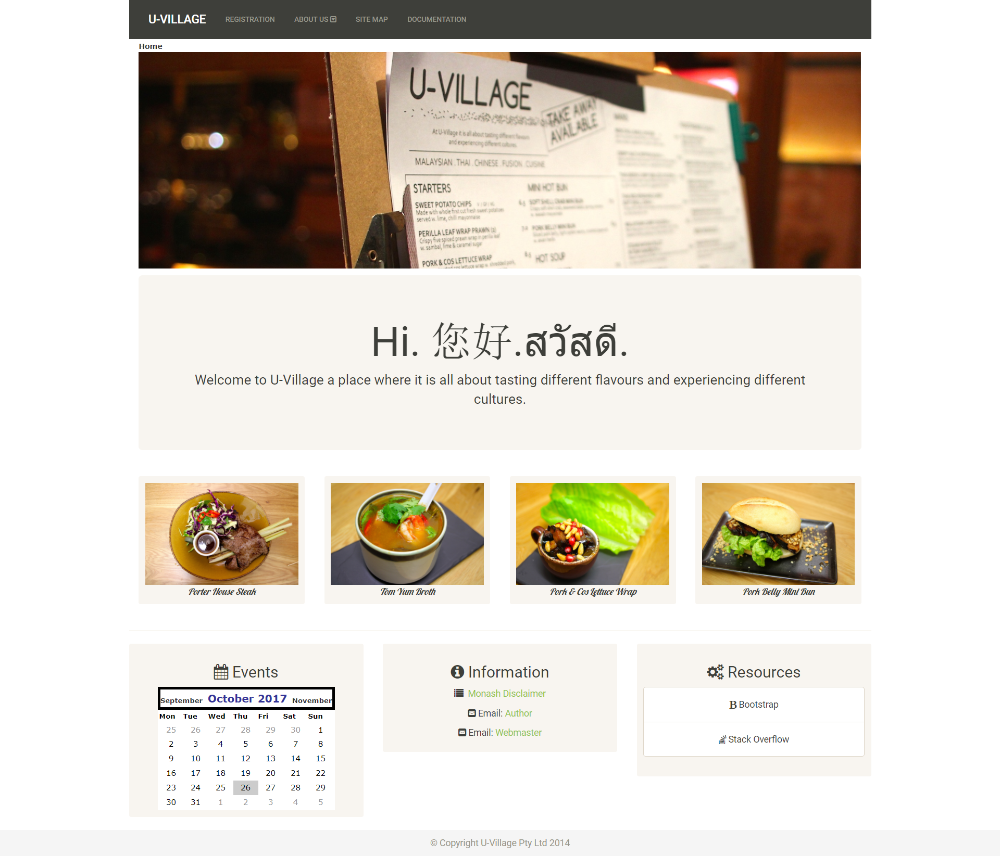
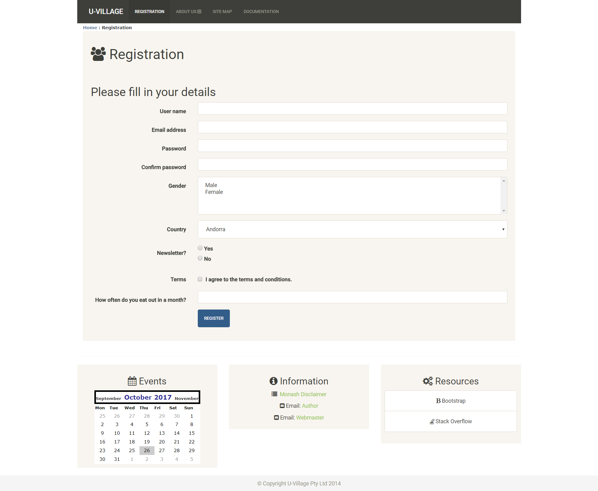
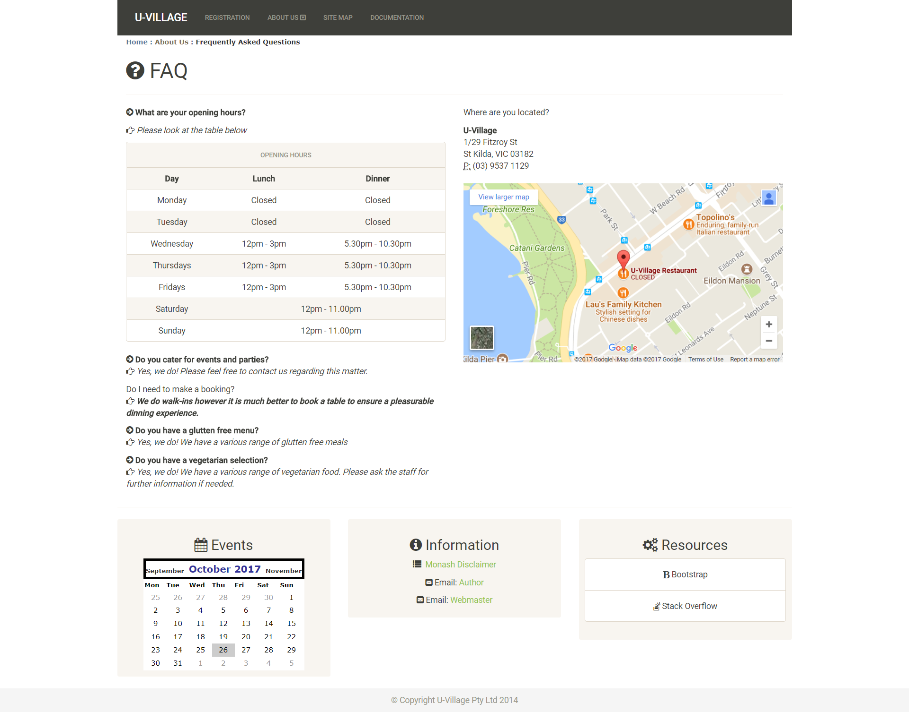
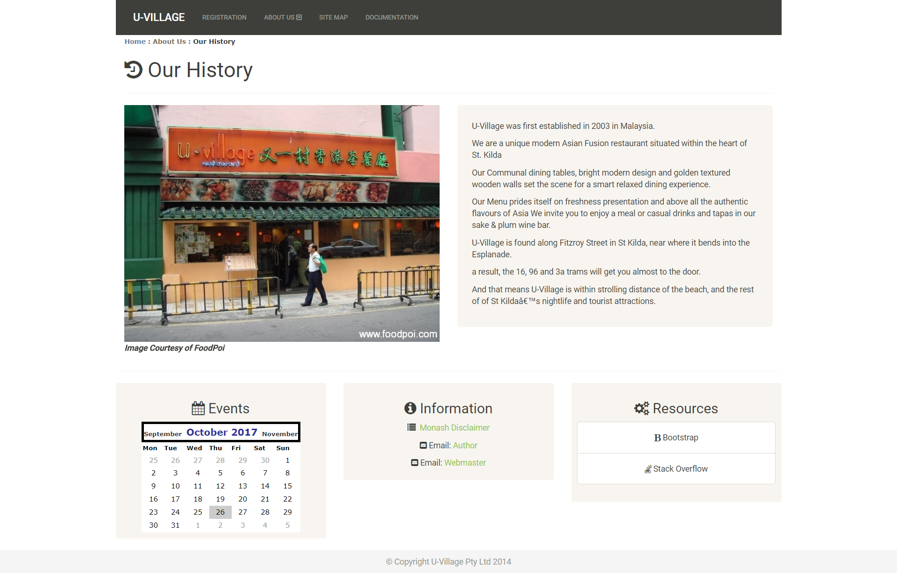

FIT5032 - Internet Application Development (Semester 2 2014)
============
| Resources |  Version      |
|---------- |:-------------:|
| Bootstrap |   3.03        |
| jQuery    |   1.91        |
| Modernizr |   2.62        |
| .NET      |   4           |

Installation Instructions
-------------------------
1. Requires IIS
2. Do either a pull or clone from the repo.
3. Run

Overview
-

This project was created on 2014 for the subject FIT5032 - Internet Application Development. The technology used was ASP Web Forms.

This website uses the old ASP WebForms and not the current MVC architecture. 
However, instead of the normal layout, a responsive layout is used. Achieved using Bootstrap 3 (Version 3.03). This was done back in 2014! The new version of Bootstrap was just only released in 2017. Back in 2014, the default templates do not provide a responsive layout.

*The Home Page*

Previously by default the navigation bar would appear on the left hand side, however I did some hacks so that the navigation bar would appear at the top. Basically the idea was to just remove the default styles. Newer developers will not know this if they have not been working on the platform for a long time.

*The Registration Page*

*The FAQ Page*

*The Our History Page*

